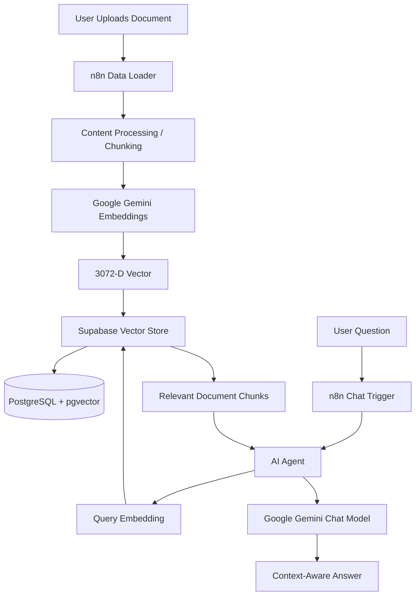

# System Architecture

## High-Level Architecture

The system is an end-to-end Retrieval-Augmented Generation (RAG) pipeline with two primary flows: document ingestion and query/retrieval.



## Ingestion Flow

1. A document enters the n8n ingestion workflow.
2. The Data Loader extracts document content.
3. Content is split/processed into retrievable chunks.
4. Google Gemini converts the chunks into vector embeddings.
5. The embeddings and document content are stored in Supabase.
6. PostgreSQL/pgvector provides the vector representation used for semantic retrieval.

## Retrieval Flow

1. A user sends a natural-language question.
2. The n8n AI Agent receives the question.
3. The query is embedded using the same embedding configuration.
4. Supabase performs vector similarity search.
5. Relevant document chunks are returned to the AI Agent.
6. Google Gemini receives the retrieved context and generates the final response.

## Important Consistency Rule

The embedding model/configuration used during document ingestion must be compatible with the embedding configuration used for query retrieval.

For this project:

```text
Gemini embedding output: 3072 dimensions
Supabase vector column:  extensions.vector(3072)
```

A dimension mismatch will cause vector insertion or retrieval errors.

## Components

| Component | Responsibility |
|---|---|
| n8n | Orchestrates the complete workflow |
| Data Loader | Reads document content |
| Gemini Embeddings | Converts text into vectors |
| Supabase Vector Store | Stores and retrieves embeddings |
| pgvector | Performs vector similarity operations |
| AI Agent | Decides when retrieval is required |
| Gemini Chat Model | Generates the final natural-language response |
| Simple Memory | Maintains conversation context |

## Data Flow Summary

```text
Document
  ↓
Extract
  ↓
Chunk
  ↓
Embed
  ↓
Store
  ↓
Retrieve
  ↓
Ground
  ↓
Generate
```
